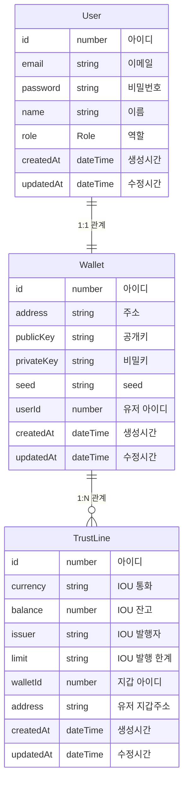
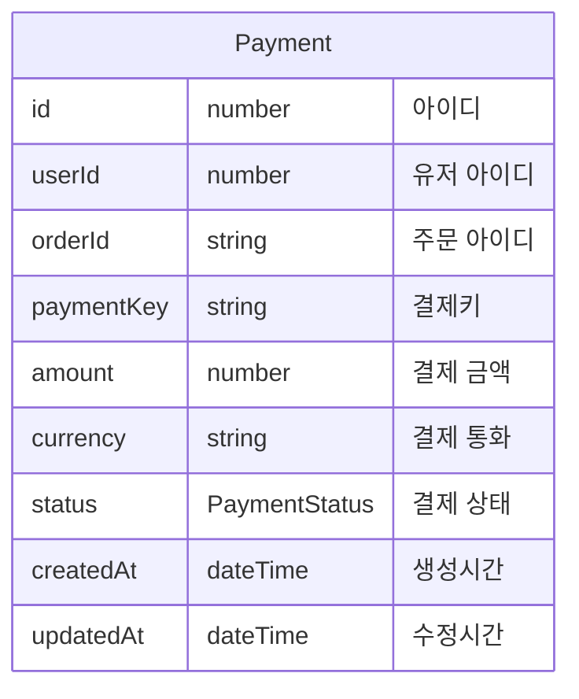
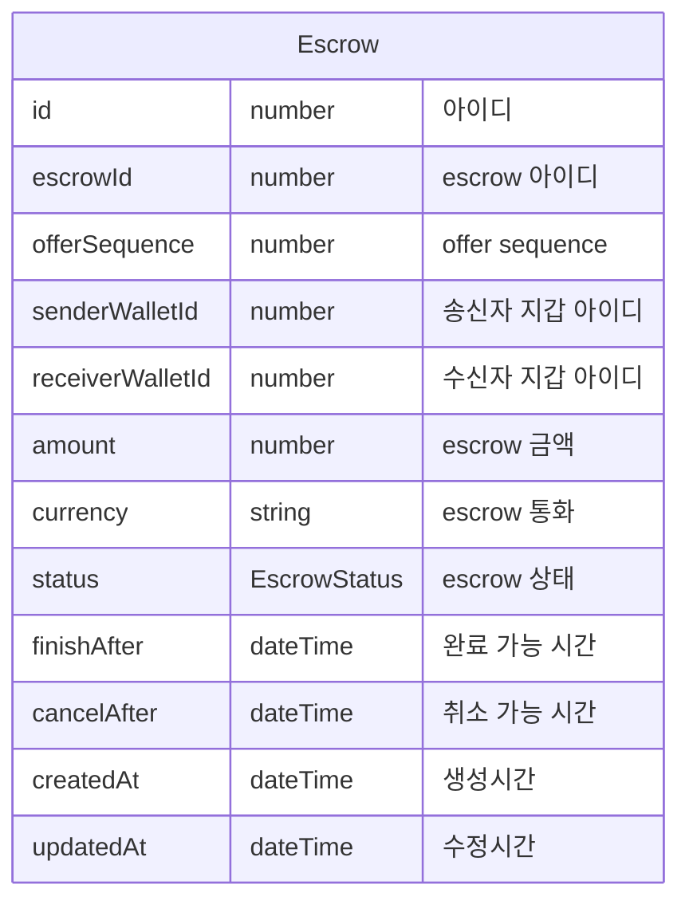
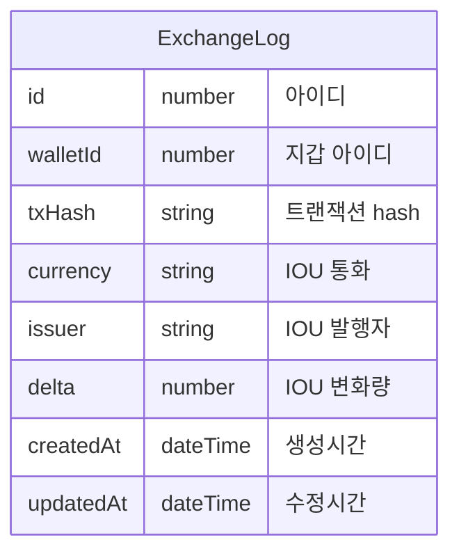
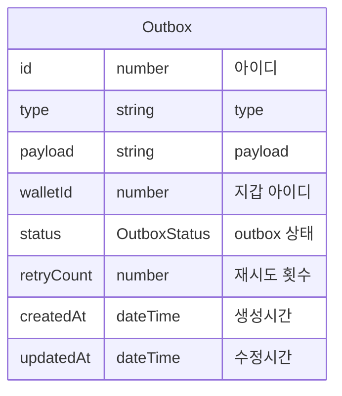

## 유저

```mermaid
erDiagram
	User {
	    id number "아이디"
        email string "이메일"
        password string "비밀번호"    
        name string "이름"
        role Role "역할"
        createdAt dateTime "생성시간"
        updatedAt dateTime "수정시간"
    }
 
	Wallet {
	    id number "아이디"  
	    address string "주소"
        publicKey  string "공개키"
        privateKey string "비밀키"
        seed string "seed"
        userId number "유저 아이디"     
        createdAt dateTime "생성시간"
        updatedAt dateTime "수정시간"
	}
  
    TrustLine {
        id number "아이디"    
        currency string "IOU 통화"
        balance number "IOU 잔고"
        issuer string "IOU 발행자"   
        limit string "IOU 발행 한계"     
        walletId number "지갑 아이디"
        address string "유저 지갑주소"  
        createdAt dateTime "생성시간"
        updatedAt dateTime "수정시간"
    }
  
    User||--||Wallet : "1:1 관계"
    Wallet||--o{TrustLine : "1:N 관계"
```

## 결제

```mermaid
erDiagram
	Payment {
	    id number "아이디"
        userId number "유저 아이디"
        orderId string "주문 아이디"
        paymentKey string "결제키"
        amount number "결제 금액"
        currency string "결제 통화" 
        status PaymentStatus "결제 상태"   
        createdAt dateTime "생성시간"
        updatedAt dateTime "수정시간"
  }
```

## Escrow

```mermaid
erDiagram
	Escrow {
        id number "아이디"
        escrowId number "escrow 아이디"
        offerSequence number "offer sequence"       
        senderWalletId number "송신자 지갑 아이디"
        receiverWalletId number "수신자 지갑 아이디"
        amount number "escrow 금액"
        currency string "escrow 통화"
        status EscrowStatus "escrow 상태"
        finishAfter dateTime "완료 가능 시간"
        cancelAfter dateTime "취소 가능 시간"
        createdAt dateTime "생성시간"
        updatedAt dateTime "수정시간"
    }
```

## 환전

```mermaid
erDiagram
	ExchangeLog {
        id number "아이디"
        walletId number "지갑 아이디"
        txHash string "트랜잭션 hash"   
        currency string "IOU 통화"  
        issuer string "IOU 발행자"   
        delta number "IOU 변화량"    
        createdAt dateTime "생성시간"
        updatedAt dateTime "수정시간"
  }
```

## Outbox

```mermaid
erDiagram
	Outbox {
        id number "아이디"
        type string "type"
        payload string "payload"    
        walletId number "지갑 아이디"
        status OutboxStatus "outbox 상태"
        retryCount number "재시도 횟수"
        createdAt dateTime "생성시간"
        updatedAt dateTime "수정시간"
    }
```